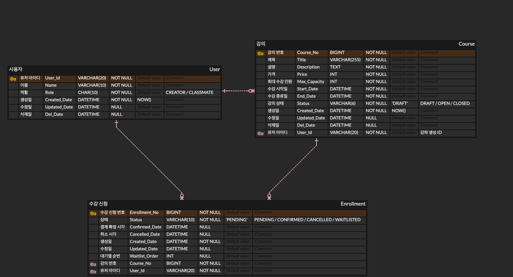

# 수강 신청 시스템

## 프로젝트 개요

강사가 강의를 개설하고 수강생이 수강 신청할 수 있는 백엔드 시스템입니다.
정원 관리, 대기열, 결제 확정, 자동 취소 등의 비즈니스 규칙을 포함합니다.

## 기술 스택

| 분류 | 사용 기술 |
|------|----------|
| Language | Java 17 |
| Framework | Spring Boot 3.3.0 |
| ORM | Spring Data JPA (Hibernate) |
| Database | MySQL 8.0 |
| Infra | Docker / Docker Compose |
| 기타 | Lombok |

## 실행 방법

### 사전 요구사항
- Java 17 이상
- Docker Desktop (MySQL은 Docker로 실행되므로 별도 설치 불필요)
- Windows의 경우 WSL2 활성화 필요

### 실행 순서

```bash
# 1. MySQL 컨테이너 실행 (테이블 생성 + 초기 데이터 자동 삽입)
docker-compose up -d

# 2. 애플리케이션 실행
./gradlew bootRun
```

서버 실행 후 `http://localhost:8080/api/courses`, `http://localhost:8080/api/enrollments` 경로로 API 사용 가능합니다.

### 초기 유저 데이터

| User_Id | 이름 | 역할 |
|---------|------|------|
| kim_creat1 | 김강사 | CREATOR |
| lee_creat1 | 이강사 | CREATOR |
| park_creat1 | 박강사 | CREATOR |
| jung_class1 | 정수강 | CLASSMATE |
| choi_class1 | 최수강 | CLASSMATE |
| kang_class1 | 강수강 | CLASSMATE |
| yoon_class1 | 윤수강 | CLASSMATE |
| jang_class1 | 장수강 | CLASSMATE |
| lim_class1 | 임수강 | CLASSMATE |
| han_class1 | 한수강 | CLASSMATE |
| oh_class1 | 오수강 | CLASSMATE |
| seo_class1 | 서수강 | CLASSMATE |
| shin_class1 | 신수강 | CLASSMATE |

## 요구사항 해석 및 가정

- 인증/인가는 `X-User-Id` 헤더로 userId를 전달받는 방식으로 처리합니다.
- 회원가입 기능은 없으며 초기 유저 데이터(`init.sql`)로 대체합니다.
- 결제 확정은 외부 시스템 연동 없이 상태 변경(`PENDING → CONFIRMED`)으로 대체합니다.
- 취소 가능 기간은 결제 확정일 기준 7일 이내로 정의합니다.
- 정원 체크 시 `CONFIRMED + PENDING` 합산 인원을 기준으로 합니다. PENDING도 자리를 차지하는 것으로 간주합니다.
- 수강 신청 후 30분 이내에 결제 확정을 하지 않으면 자동으로 `CANCELLED` 처리됩니다.
- 대기열은 신청 순서대로 순번이 부여되며, 자리가 생길 때마다 가장 낮은 순번의 대기자가 자동으로 PENDING으로 전환됩니다.
- 강의 상태는 `DRAFT → OPEN → CLOSED` 일방향으로만 전환됩니다.
- 수강 신청 상태는 `PENDING → CONFIRMED → CANCELLED` 일방향으로만 전환됩니다. 취소는 CONFIRMED 상태에서만 가능합니다.

## 설계 결정과 이유

### 비관적 락 (`SELECT FOR UPDATE`)
동시에 여러 수강생이 마지막 자리에 신청하는 경우를 대비해 수강 신청 시 `Course` 행에 비관적 락을 적용했습니다. 락이 걸린 동안 다른 트랜잭션은 대기하며, 순서대로 정원 체크 후 처리됩니다. 락 대기 시간은 10초로 설정하며, 초과 시 `503` 응답과 함께 재시도 안내 메시지를 반환합니다.

### FK를 ID 값으로만 보관
`@ManyToOne` 대신 `courseNo`, `userId`를 단순 필드로 보관했습니다. 불필요한 JOIN을 줄이고 구조를 단순하게 유지했습니다.

### 소프트 삭제 (`Del_Date`)
`Course`, `User` 엔티티는 실제 삭제 대신 `Del_Date`를 기록하는 방식으로 데이터를 보존합니다.

### Inner Enum
각 엔티티 내부에 `Status`, `Role` enum을 정의했습니다. 관련 타입을 한 파일에서 관리할 수 있어 응집도를 높였습니다.

### PENDING 자동 취소 스케줄러
5분마다 실행되며, 신청 후 30분이 지난 PENDING 건을 자동으로 취소합니다. 취소 시 대기열 첫 번째 항목이 자동으로 PENDING으로 전환됩니다.

## 미구현 / 제약사항

- 실제 결제 시스템 미연동
- 인증/인가 미구현 (X-User-Id 헤더로 대체)
- 강의 수정/삭제 기능 미구현
- 대기자 PENDING 전환 시 문자 알림 미구현
- 수강 기간(시작일/종료일)과 모집 기간(등록 시작일/종료일)이 분리되지 않아 강의 상태 자동 전환 미구현 (강사가 직접 상태 변경 필요)

## AI 활용 범위

Claude AI를 아래 영역에서 활용했습니다.

- **코드 작성**: 패키지 구조 설계, Entity / Repository / Service / Controller 코드 작성, 예외 처리 구조
- **문서 작성**: README 초안 작성

아래 사항은 직접 판단하고 결정했습니다.

- DB 설계 (테이블 구조, 컬럼 타입, 관계 정의)
- FK를 ID로만 보관하는 방식 선택
- 정원 체크 기준을 CONFIRMED + PENDING 합산으로 정의
- 30분 미결제 자동 취소 요구사항 도출 및 스케줄러 설계
- 낙관적 락 동작 방식 이해 및 검증
- Postman을 통한 전체 API 흐름 테스트 및 검증

## API 목록 및 예시

> 인증이 필요한 API는 요청 헤더에 `X-User-Id: {userId}` 를 포함해야 합니다.

### 강의 (Course)

---

#### 강의 등록
```
POST http://localhost:8080/api/courses
X-User-Id: kim_creat1
Content-Type: application/json
```
```json
{
  "title": "스프링 강의",
  "description": "스프링 부트 기초",
  "price": 50000,
  "maxCapacity": 3,
  "startDate": "2026-05-01T09:00:00",
  "endDate": "2026-05-31T18:00:00"
}
```
응답 예시
```json
{
  "courseNo": 1,
  "title": "스프링 강의",
  "status": "DRAFT",
  "currentEnrollment": 0,
  "maxCapacity": 3
}
```

---

#### 강의 목록 조회
```
GET http://localhost:8080/api/courses
GET http://localhost:8080/api/courses?status=OPEN
```
- `status` 파라미터 생략 시 전체 조회
- 가능한 값: `DRAFT`, `OPEN`, `CLOSED`

---

#### 강의 상세 조회
```
GET http://localhost:8080/api/courses/{courseNo}
```

---

#### 강의 상태 변경
```
PATCH http://localhost:8080/api/courses/{courseNo}/status
X-User-Id: kim_creat1
Content-Type: application/json
```
```json
{ "status": "OPEN" }
```
- 상태 전환 규칙: `DRAFT` → `OPEN` → `CLOSED`
- 역방향 전환 불가

---

### 수강 신청 (Enrollment)

---

#### 수강 신청
```
POST http://localhost:8080/api/enrollments
X-User-Id: jung_class1
Content-Type: application/json
```
```json
{ "courseNo": 1 }
```
응답 예시 (정원 여유 있을 때)
```json
{
  "enrollmentNo": 1,
  "status": "PENDING",
  "waitlistOrder": null
}
```
응답 예시 (정원 초과 시)
```json
{
  "enrollmentNo": 2,
  "status": "WAITLISTED",
  "waitlistOrder": 1
}
```

---

#### 결제 확정
```
POST http://localhost:8080/api/enrollments/{enrollmentNo}/confirm
X-User-Id: jung_class1
```
- `PENDING` 상태인 신청만 확정 가능
- 신청 후 30분 이내에 확정하지 않으면 자동 취소

---

#### 수강 취소
```
POST http://localhost:8080/api/enrollments/{enrollmentNo}/cancel
X-User-Id: jung_class1
```
- `CONFIRMED` 상태인 신청만 취소 가능
- 결제 확정일로부터 7일 이내만 취소 가능
- 취소 시 대기열 첫 번째 항목이 자동으로 `PENDING` 전환

---

#### 내 수강 신청 목록 조회
```
GET http://localhost:8080/api/enrollments/my?page=0&size=10
X-User-Id: jung_class1
```
- 페이지네이션 지원 (`page`, `size` 파라미터)

---

#### 강의별 수강생 목록 조회 (강사 전용)
```
GET http://localhost:8080/api/enrollments/courses/{courseNo}
X-User-Id: kim_creat1
```
- 강사 본인 강의만 조회 가능
- `CONFIRMED` 상태인 수강생만 반환

## 테스트 시나리오

### 7일 이후 취소 불가 테스트

실제로 7일을 기다릴 수 없으므로 코드를 임시 수정해서 테스트합니다.

`EnrollmentService.java`에서 아래 부분을 수정합니다.

```java
// 변경 전
if (enrollment.getConfirmedDate().plusDays(7).isBefore(LocalDateTime.now())) {

// 변경 후 (1분으로 단축)
if (enrollment.getConfirmedDate().plusMinutes(1).isBefore(LocalDateTime.now())) {
```

1. 수강 신청 → 결제 확정 → 1분 후 취소 시도
2. `400 취소 가능 기간(7일)이 지났습니다.` 응답 확인
3. 테스트 완료 후 `plusDays(7)`로 원복

---

### 30분 미결제 자동 취소 테스트

스케줄러가 30분을 기다리므로 코드를 임시 수정해서 테스트합니다.

`EnrollmentScheduler.java`에서 아래 부분을 수정합니다.

```java
// 변경 전
LocalDateTime expiredTime = LocalDateTime.now().minusMinutes(30);

// 변경 후 (1분으로 단축)
LocalDateTime expiredTime = LocalDateTime.now().minusMinutes(1);
```

1. 수강 신청 후 결제 확정 없이 1분 대기
2. 스케줄러 실행 후 신청 상태가 `CANCELLED`로 변경되는지 확인
3. 대기열에 있던 수강생이 자동으로 `PENDING`으로 전환되는지 확인
4. 테스트 완료 후 `minusMinutes(30)`으로 원복

---

### 비관적 락 동시성 테스트

정원 1명짜리 강의에 동시에 여러 명이 신청하는 테스트입니다.

강의 등록 → OPEN 변경 후 터미널에서 아래 명령어를 실행합니다.

```bash
for user in jung_class1 choi_class1 kang_class1 yoon_class1 jang_class1; do
  curl -s -X POST http://localhost:8080/api/enrollments \
    -H "Content-Type: application/json" \
    -H "X-User-Id: $user" \
    -d '{"courseNo": 1}' &
done
wait
```

1명만 `PENDING` 성공, 나머지는 대기열(`WAITLISTED`) 또는 타임아웃 응답 확인

---

### 취소 시 대기자 자동 PENDING 전환 테스트

1. 정원 1명짜리 강의에 2명 신청 → 1명 `PENDING`, 1명 `WAITLISTED` 확인
2. `PENDING` 수강생 결제 확정 → `CONFIRMED`
3. `CONFIRMED` 수강생 취소
4. `WAITLISTED` 수강생이 자동으로 `PENDING`으로 전환되는지 확인

```
GET http://localhost:8080/api/enrollments/my
X-User-Id: {대기자 userId}
```

## 데이터 모델 설명



### User
| 컬럼 | 타입 | 설명 |
|------|------|------|
| User_Id | VARCHAR(20) | 사용자 ID (PK) |
| Name | VARCHAR(10) | 이름 |
| Role | CHAR(10) | 역할 (CREATOR / CLASSMATE) |
| Created_Date | DATETIME | 생성일시 |
| Updated_Date | DATETIME | 수정일시 |
| Del_Date | DATETIME | 삭제일시 |

### Course
| 컬럼 | 타입 | 설명 |
|------|------|------|
| Course_No | BIGINT | 강의 번호 (PK) |
| Title | VARCHAR(255) | 강의 제목 |
| Description | TEXT | 강의 설명 |
| Price | INT | 수강료 |
| Max_Capacity | INT | 최대 수강 인원 |
| Start_Date | DATETIME | 강의 시작일 |
| End_Date | DATETIME | 강의 종료일 |
| Status | VARCHAR(6) | 상태 (DRAFT / OPEN / CLOSED) |
| Created_Date | DATETIME | 생성일시 |
| Updated_Date | DATETIME | 수정일시 |
| Del_Date | DATETIME | 삭제일시 |
| User_Id | VARCHAR(20) | 강사 ID (FK) |

### Enrollment
| 컬럼 | 타입 | 설명 |
|------|------|------|
| Enrollment_No | BIGINT | 신청 번호 (PK) |
| Status | VARCHAR(10) | 상태 (PENDING / CONFIRMED / CANCELLED / WAITLISTED) |
| Confirmed_Date | DATETIME | 결제 확정 일시 |
| Cancelled_Date | DATETIME | 취소 일시 |
| Created_Date | DATETIME | 생성일시 |
| Updated_Date | DATETIME | 수정일시 |
| Waitlist_Order | INT | 대기열 순번 |
| Course_No | BIGINT | 강의 번호 (FK) |
| User_Id | VARCHAR(20) | 수강생 ID (FK) |

## 테스트 실행 방법

Docker MySQL이 실행 중인 상태에서 실행합니다.

```bash
./gradlew test
```
